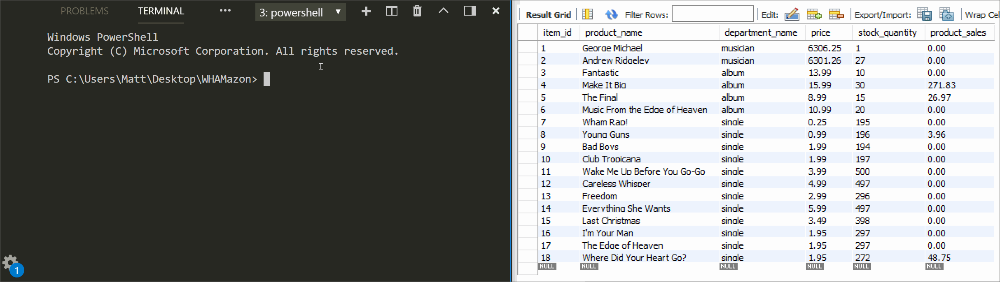

# CLI - MySQL app "WHAMazon"

### Simulate a store's inventory and sales with MySQL and the Node command line interface.
WHAMazaon has three different applications:

1. **Customer** - Allows customers to make orders, and in turn, depletes stock from the store's inventory. The customer will be informed of the toal cost of their purchase while the sales revenue is updated for the product's department.

------------------------------------------------------------------------------------------
2. **Manager** - Allows a manager to choose from 4 options:
    * View Products for Sale - See the entire inventory, with stock quantity included.
    * View Low Inventory - Only display inventory with 5 or fewer units in stock.
    * Add to Inventory - Add stock for any existing item.
    * Add New Product - Create a new product to introduce to the store's database.
    

------------------------------------------------------------------------------------------
3. **Supervisor** - Allows a supervisor to choose from 2 options (second pending.)
    * Create a new department of products for the store's database.
    [ ] View sales by department, including profit margins from sales/overhead differences.
------------------------------------------------------------------------------------------
### Languages & Programs Used
  * JavaScript
  * Nodejs
  * MySQL

### Required Node packages and other sources
* [mysql](https://www.npmjs.com/package/mysql)
* [Inquirer.js](https://www.npmjs.com/package/inquirer#examples)
* [CLI Table](https://www.npmjs.com/package/cli-table)
* [colors.js](https://www.npmjs.com/package/colors)
* [LICEcap Screen recording to gif application](https://www.cockos.com/licecap/)
